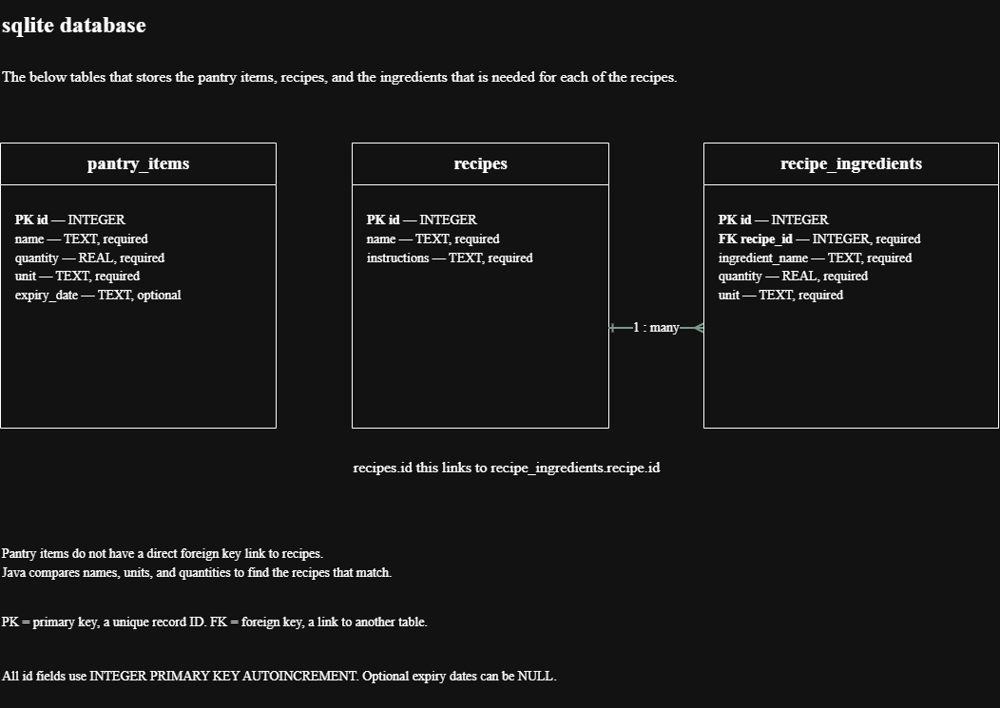

# Smart Pantry Manager

Smart Pantry Manager it is a Java Android application that helps on cutting down food waste. Users can add the ingredients that they have at home that is in their pantry and then the application will suggest recipes that they are able to make right now using only the ingredients that is leftover.

A recipe it will only be suggested if every single ingredient it needs is in the pantry in the amount that is needed or more and this is called strict matching. For example if a recipe needs 5 ingredients and the pantry only has 4 of them then that recipe it will not be shown.

## Features

- Pantry management where the user can add, edit and delete pantry items that has a name, quantity, unit and an expiry date that is optional.
- A pantry list that shows all of the ingredients in a RecyclerView with a custom adapter that is loaded from the database.
- 18 recipes that is loaded inside of the database the very first time the app opens and each recipe it has ingredients and steps for cooking.
- Suggested Recipes this only shows the recipes where every ingredient is in the pantry in the amount that is needed.
- Units that are different it gets converted, kg to g, l to ml and 1 tsp is 5 ml, and names that are plural like tomatoes it will still match tomato.
- Recipe details that shows the full list of ingredients and the method for the recipe that is selected.
- Settings where the expiry dates can be shown or hidden and the choice it is saved with SharedPreferences.
- Input validation on the forms and messages that are clear when the pantry is empty or when no recipes match.

## Screens

1. Pantry List
2. Add/Edit Ingredient
3. Suggested Recipes
4. Recipe Detail
5. Settings

## Database choice: SQLite

I chose SQLite using SQLiteOpenHelper because of the following reasons.

Firstly, the data it belongs to one user on one phone so there is no need for a server, an account or internet and the app it is able to work offline.

Secondly, the data is relational because one recipe it has many ingredients that is linked with a foreign key and this suits tables in SQL very well.

Thirdly, SQLite it is built inside of Android and it is the database approach that was covered in the module.

The tables that is used are `pantry_items`, `recipes` and `recipe_ingredients`.



The pantry items it has full CRUD, the user is able to create, read, update and delete items and the data it stays saved even after the app is closed and opened again.

## Setup and run

You will need Android Studio and a phone or an emulator that is Android 7.0 (API 24) or newer.

1. Install Android Studio, the latest version that is stable.
2. Clone the repository:
```bash
  git clone https://github.com/Aashiq-A/smart-pantry-manager.git
```
3. Open the project folder in Android Studio and wait for Gradle to finish the sync.
4. Connect an Android phone with USB debugging that is turned on, or start an emulator.
5. Click **Run** and the database and the 18 recipes it gets created the first time the app opens.

## Tests

- Unit tests that checks the matching, unit conversion and the cleaning of names: right-click `app/src/test/java` > **Run 'Tests in java'**
- Database tests that needs a phone or an emulator: right-click `app/src/androidTest/java` > **Run 'Tests in java'**

## Scope

The app it does not use Google Maps, any mapping SDK or location and GPS services and it has no payments, as the brief requires that the app it stays only on the user's pantry and the matching of recipes.

## References

It is listed in [docs/REFERENCES.md](docs/REFERENCES.md).

